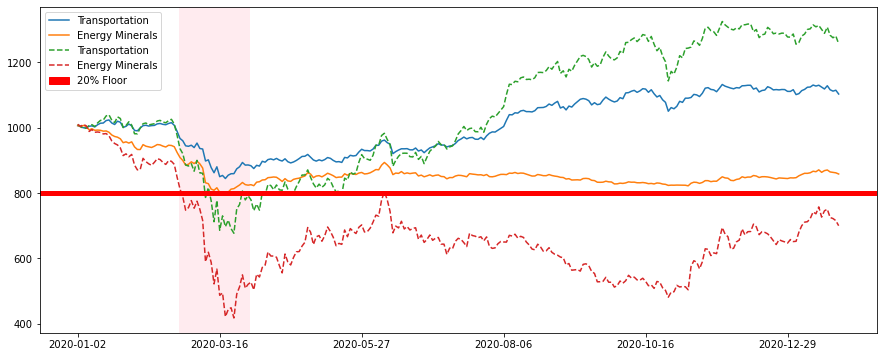
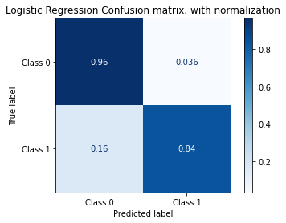
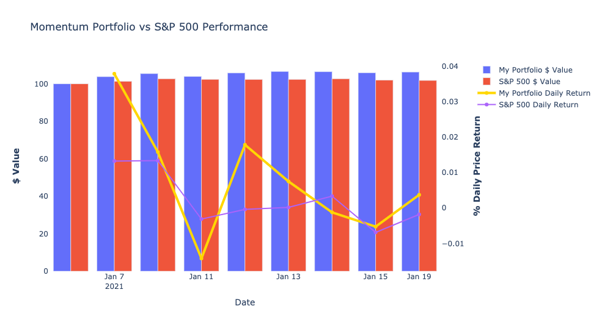

# Fedor Levin's Data Science Portfolio

## [Constant Proportion Portfolio Insurance - Industry Portfolio](https://github.com/fedormlevin/cppi-industry-portfolio/blob/main/README.md)

- Created industry indexes based on S&P500 prises and market capitalization
- Applied CPPI model using STIP ETF as a "safe" asset
- Compared price returns of the combined portfolio to the "risky" (equity only) portfolio
- Achieved significant max drawdown reduction (38% for "Energy Minerals")

## [Sentiment Analysis - Markers - Amazon Reviews](https://github.com/fedormlevin/sentiment-amazon-markers-reviews/blob/main/README.md)

- Created Logistic Regression models predicting Positive/Negative labels for Amazon reviews of acrylic markers
- Engineered features using N-grams and Tfidf
- Optimized using GridsearchCV to reach the best model
- Achieved Area Under Curve: 0.90 

## [Momentum - Value - Portfolio - S&P500](https://github.com/fedormlevin/momentum-value-portfolio/blob/main/README.md)

- Created 2 portfolios based on price momentums and value indicators
- Back-tested on historic prices to determine reallocation strategy
- Compared price return performance with benchmark 

